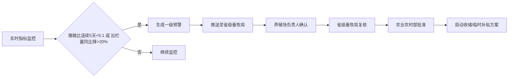

# 全国生猪产业链监测与调控智能分析平台 PRD

## 1. 产品概述

全国生猪产业链监测与调控智能分析平台是面向农业农村部、各省级畜牧局及市级管理部门的产业监管与决策支持系统，通过实时接入养殖场、屠宰场、批发市场全链条数据，实现生猪产业全景化监测、智能化预警、科学化调控。

- **核心价值**：打破数据孤岛，构建全国统一的生猪产业链数字档案，为宏观调控提供精准数据支撑，防范市场大幅波动，保障猪肉供应安全。
- **目标用户**：农业农村部、省级畜牧局、市级农业部门、养殖场/屠宰场负责人。

## 2. 核心功能

### 2.1 用户角色

| 角色 | 注册方式 | 核心权限 |
|------|----------|----------|
| 国家级管理员 | 后台开通 | 全国数据查看、审批收储方案、发布全国报告 |
| 省级管理员 | 后台开通 | 本省数据查看、复核预警、审批省级方案、发布省级报告 |
| 市级管理员 | 后台开通 | 本市数据查看、确认预警信息、查看本市报表 |
| 养殖场/屠宰场负责人 | 企业注册 | 上报数据、查看本厂数据、确认预警通知 |

### 2.2 功能模块

1. **登录与权限中心**：三级权限认证、数据范围隔离
2. **核心监测看板**：全国生猪存栏热力图、猪价排名、关键指标概览
3. **产业链数据中心**：养殖场/屠宰场/批发市场数据接入、清洗、档案管理
4. **智能预警中心**：预警规则配置、实时预警、预警推送
5. **审批流程中心**：三级审批（场长确认→省级复核→农业部批准）、收储/补贴方案管理
6. **预测分析中心**：供应缺口预测、饲料成本走势、补栏/压栏策略推荐
7. **报告自动生成**：每周产业健康诊断报告、Excel报表导出
8. **系统管理**：用户管理、基础数据配置、系统参数设置

### 2.3 页面详情

| 页面名称 | 模块名称 | 功能描述 |
|----------|----------|----------|
| 登录页 | 身份认证 | 账号密码登录、角色选择、验证码校验 |
| 核心看板 | 概览卡片 | 全国总存栏、总出栏、平均料肉比、猪粮比价实时展示 |
| 核心看板 | 存栏热力图 | 分省份存栏量可视化，支持下钻到地市 |
| 核心看板 | 猪价排名 | 各省份白条价格排名、涨跌幅标识 |
| 核心看板 | 趋势曲线 | 近7天出栏趋势、疫病阳性率分布 |
| 数据中心 | 养殖场列表 | 养殖场基本信息、存栏/出栏/饲料/疫病数据查看 |
| 数据中心 | 屠宰场列表 | 屠宰量、白条价格数据接入与查询 |
| 数据中心 | 批发市场 | 交易数据、价格走势分析 |
| 数据中心 | 数据上传 | 能繁母猪Excel、饲料价格表上传与解析 |
| 预警中心 | 预警列表 | 一级/二级预警展示、处理状态跟踪 |
| 预警中心 | 预警详情 | 预警原因分析、影响范围评估、历史趋势对比 |
| 审批中心 | 待审批列表 | 收储方案、补贴方案待办事项 |
| 审批中心 | 审批流程 | 三级审批流转、意见填写、附件上传 |
| 预测分析 | 供应预测 | 未来3个月生猪供应缺口预测曲线 |
| 预测分析 | 成本预测 | 饲料成本走势、养殖利润分析 |
| 预测分析 | 策略推荐 | 最优补栏/压栏策略、品种调整建议 |
| 报告中心 | 周报列表 | 每周产业健康诊断报告查看与下载 |
| 报告中心 | 报告详情 | 存栏同比、疫病发生率、成本利润分析 |
| 系统管理 | 用户管理 | 三级用户增删改、权限分配 |
| 系统管理 | 基础配置 | 省份、品种、养殖规模等基础数据维护 |

## 3. 核心流程

### 3.1 数据接入与处理流程

养殖场/屠宰场通过API或Excel上报数据 → 系统自动清洗去重 → 合并为统一产业链档案 → 实时计算核心指标（存栏变化率、料肉比、猪粮比价）→ 触发预警规则判断 → 更新看板与报表

### 3.2 预警与审批流程

### 3.3 预测分析流程

用户上传能繁母猪数据 + 饲料价格表 → 系统提取关键参数 → 结合历史数据训练模型 → 生成未来3个月供应缺口预测 → 计算饲料成本走势 → 输出最优补栏/压栏策略

## 4. 用户界面设计

### 4.1 设计风格
- **主色调**：深绿色(#1B5E20) 代表农业、生机、权威
- **辅助色**：橙色(#FF6D00) 用于预警标识、数据高亮
- **中性色**：深蓝灰(#263238) 背景色、浅灰(#F5F7FA) 卡片背景
- **按钮风格**：圆角8px，主要按钮使用渐变绿色，带有微妙阴影
- **字体**：标题使用思源宋体，正文使用思源黑体，体现专业政府系统气质
- **布局风格**：卡片式布局，顶部导航 + 左侧菜单 + 主内容区
- **图标风格**：线性图标，统一2px线条，颜色与主色调一致

### 4.2 页面设计概览

| 页面名称 | 模块名称 | UI元素 |
|----------|----------|--------|
| 核心看板 | 概览卡片 | 大数字展示、趋势箭头、红绿涨跌幅标识 |
| 核心看板 | 热力图 | 中国地图着色、hover显示详情、点击下钻 |
| 核心看板 | 数据表格 | 斑马纹、排序箭头、状态标签 |
| 预警中心 | 预警列表 | 红色紧急预警标签、进度条展示处理阶段 |
| 审批中心 | 审批流程 | 时间轴样式展示三级审批进度 |
| 预测分析 | 趋势图表 | 平滑曲线、置信区间阴影、数据点标注 |

### 4.3 响应式
- 桌面端优先设计（1920×1080）
- 支持平板自适应（≥768px），菜单可折叠
- 核心看板、数据列表支持横向滚动查看

### 4.4 动效设计
- 页面加载：卡片错落淡入效果，stagger 100ms
- 数据更新：数字滚动动画，指标变化时高亮闪烁
- 悬停效果：卡片上浮2px，阴影加深
- 预警提示：呼吸灯动画，吸引注意

## 5. 非功能需求

1. **性能要求**：核心看板首屏加载≤3s，实时数据更新延迟≤5s
2. **数据安全**：三级等保，数据传输加密，操作日志审计
3. **并发能力**：支持1000并发用户同时在线
4. **可用性**：系统可用性≥99.9%，支持7×24运行
