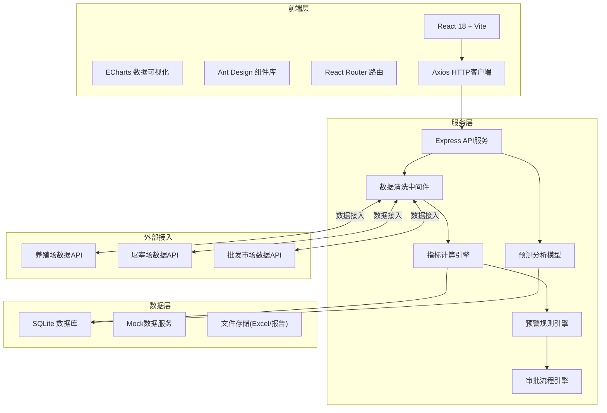
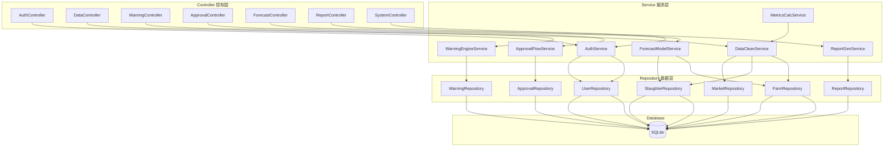
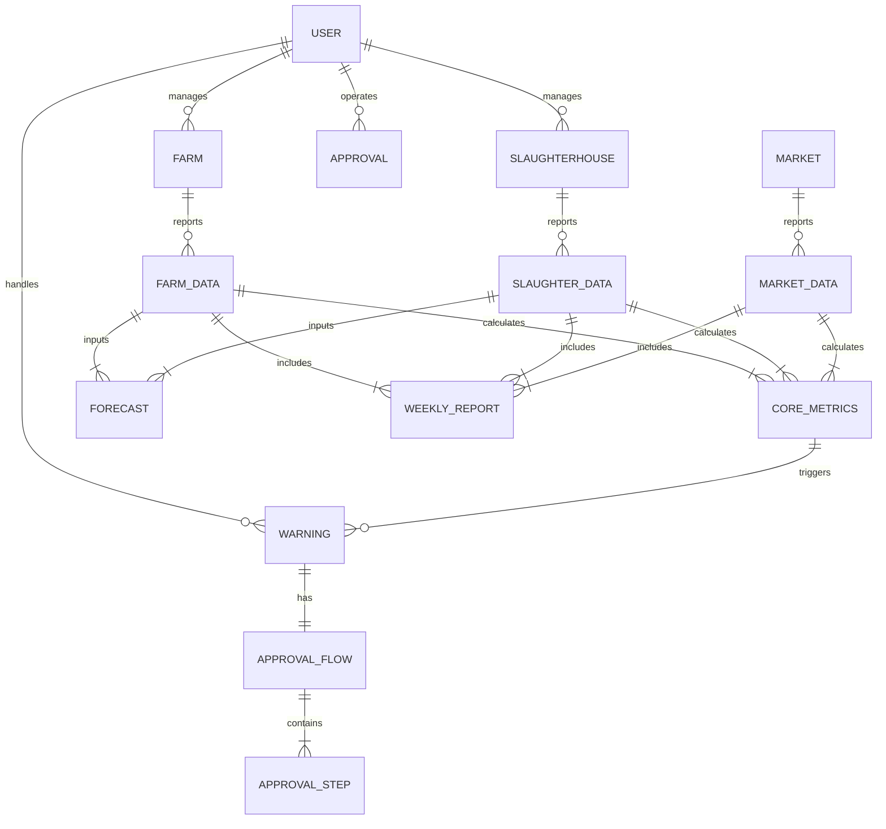

# 全国生猪产业链监测与调控智能分析平台 技术架构

## 1. 架构设计



## 2. 技术描述

- **前端**: React@18 + TypeScript + tailwindcss@3 + Vite@5
- **UI组件**: Ant Design@5 + 自定义主题
- **数据可视化**: ECharts@5（热力图、折线图、柱状图、地图）
- **路由**: React Router@6
- **状态管理**: Zustand（轻量级状态管理）
- **后端**: Express@4 + TypeScript
- **数据库**: SQLite（便于部署，包含完整mock数据）
- **Excel处理**: SheetJS (xlsx)
- **报告生成**: html2pdf.js
- **HTTP客户端**: Axios

## 3. 路由定义

| 路由 | 页面 | 权限级别 |
|------|------|----------|
| /login | 登录页 | 公开 |
| /dashboard | 核心监测看板 | 所有登录用户 |
| /data/farms | 养殖场数据中心 | 省/市/国家级 |
| /data/slaughterhouses | 屠宰场数据中心 | 省/市/国家级 |
| /data/markets | 批发市场数据中心 | 省/市/国家级 |
| /data/upload | 数据上传 | 所有角色 |
| /warning | 预警中心 | 省/市/国家级 |
| /approval | 审批中心 | 省/国家级 |
| /forecast | 预测分析 | 省/国家级 |
| /reports | 报告中心 | 所有登录用户 |
| /system/users | 用户管理 | 国家级 |
| /system/config | 系统配置 | 国家级 |

## 4. API 定义

```typescript
// 用户相关
interface LoginRequest {
  username: string;
  password: string;
  role: 'national' | 'provincial' | 'municipal' | 'enterprise';
}

interface UserInfo {
  id: string;
  name: string;
  role: string;
  province?: string;
  city?: string;
  permissions: string[];
}

// 养殖场数据
interface FarmData {
  id: string;
  name: string;
  province: string;
  city: string;
  scale: 'small' | 'medium' | 'large';
  breed: string;
  inventory: number;
  slaughter: number;
  feedConsumption: number;
  diseasePositiveRate: number;
  reportDate: string;
}

// 屠宰场数据
interface SlaughterhouseData {
  id: string;
  name: string;
  province: string;
  city: string;
  slaughterVolume: number;
  carcassPrice: number;
  reportDate: string;
}

// 批发市场数据
interface MarketData {
  id: string;
  name: string;
  province: string;
  city: string;
  tradeVolume: number;
  averagePrice: number;
  reportDate: string;
}

// 核心指标
interface CoreMetrics {
  totalInventory: number;
  totalSlaughter: number;
  avgFeedConversionRatio: number;
  avgGrainRatio: number;
  inventoryChangeRate: number;
  avgSlaughterWeight: number;
}

// 预警信息
interface Warning {
  id: string;
  type: 'grain_ratio' | 'slaughter_drop';
  level: 'primary' | 'secondary';
  province: string;
  description: string;
  triggeredAt: string;
  status: 'pending' | 'confirmed' | 'reviewed' | 'approved' | 'resolved';
  approvalFlow: ApprovalStep[];
}

interface ApprovalStep {
  id: string;
  step: number;
  role: string;
  status: 'pending' | 'approved' | 'rejected';
  comment?: string;
  operator?: string;
  operatedAt?: string;
}

// 预测结果
interface ForecastResult {
  months: string[];
  supplyForecast: number[];
  supplyGap: number[];
  feedCostForecast: number[];
  recommendedStrategy: string;
  confidence: number;
}

// 周报
interface WeeklyReport {
  id: string;
  week: string;
  province?: string;
  inventoryYoY: number;
  diseaseRate: number;
  costProfitAnalysis: string;
  recommendations: string[];
  createdAt: string;
}
```

## 5. 服务端架构



## 6. 数据模型

### 6.1 ER图



### 6.2 DDL 语句

```sql
-- 用户表
CREATE TABLE users (
  id TEXT PRIMARY KEY,
  username TEXT UNIQUE NOT NULL,
  password TEXT NOT NULL,
  name TEXT NOT NULL,
  role TEXT NOT NULL CHECK (role IN ('national', 'provincial', 'municipal', 'enterprise')),
  province TEXT,
  city TEXT,
  permissions TEXT,
  created_at TEXT DEFAULT CURRENT_TIMESTAMP
);

-- 养殖场表
CREATE TABLE farms (
  id TEXT PRIMARY KEY,
  name TEXT NOT NULL,
  province TEXT NOT NULL,
  city TEXT NOT NULL,
  scale TEXT NOT NULL CHECK (scale IN ('small', 'medium', 'large')),
  breed TEXT NOT NULL,
  manager_id TEXT REFERENCES users(id),
  created_at TEXT DEFAULT CURRENT_TIMESTAMP
);

-- 养殖场数据表
CREATE TABLE farm_data (
  id TEXT PRIMARY KEY,
  farm_id TEXT REFERENCES farms(id),
  inventory INTEGER NOT NULL,
  slaughter INTEGER NOT NULL,
  feed_consumption REAL NOT NULL,
  disease_positive_rate REAL NOT NULL,
  average_weight REAL NOT NULL,
  report_date TEXT NOT NULL,
  created_at TEXT DEFAULT CURRENT_TIMESTAMP
);

-- 屠宰场表
CREATE TABLE slaughterhouses (
  id TEXT PRIMARY KEY,
  name TEXT NOT NULL,
  province TEXT NOT NULL,
  city TEXT NOT NULL,
  manager_id TEXT REFERENCES users(id),
  created_at TEXT DEFAULT CURRENT_TIMESTAMP
);

-- 屠宰场数据表
CREATE TABLE slaughter_data (
  id TEXT PRIMARY KEY,
  slaughterhouse_id TEXT REFERENCES slaughterhouses(id),
  slaughter_volume INTEGER NOT NULL,
  carcass_price REAL NOT NULL,
  report_date TEXT NOT NULL,
  created_at TEXT DEFAULT CURRENT_TIMESTAMP
);

-- 批发市场表
CREATE TABLE markets (
  id TEXT PRIMARY KEY,
  name TEXT NOT NULL,
  province TEXT NOT NULL,
  city TEXT NOT NULL,
  created_at TEXT DEFAULT CURRENT_TIMESTAMP
);

-- 批发市场数据表
CREATE TABLE market_data (
  id TEXT PRIMARY KEY,
  market_id TEXT REFERENCES markets(id),
  trade_volume INTEGER NOT NULL,
  average_price REAL NOT NULL,
  report_date TEXT NOT NULL,
  created_at TEXT DEFAULT CURRENT_TIMESTAMP
);

-- 核心指标表
CREATE TABLE core_metrics (
  id TEXT PRIMARY KEY,
  province TEXT NOT NULL,
  city TEXT,
  total_inventory INTEGER NOT NULL,
  total_slaughter INTEGER NOT NULL,
  avg_feed_conversion_ratio REAL NOT NULL,
  avg_grain_ratio REAL NOT NULL,
  inventory_change_rate REAL NOT NULL,
  avg_slaughter_weight REAL NOT NULL,
  calculate_date TEXT NOT NULL,
  created_at TEXT DEFAULT CURRENT_TIMESTAMP
);

-- 预警表
CREATE TABLE warnings (
  id TEXT PRIMARY KEY,
  type TEXT NOT NULL CHECK (type IN ('grain_ratio', 'slaughter_drop')),
  level TEXT NOT NULL CHECK (level IN ('primary', 'secondary')),
  province TEXT NOT NULL,
  description TEXT NOT NULL,
  triggered_at TEXT NOT NULL,
  status TEXT NOT NULL DEFAULT 'pending' CHECK (status IN ('pending', 'confirmed', 'reviewed', 'approved', 'resolved')),
  current_step INTEGER DEFAULT 0,
  created_at TEXT DEFAULT CURRENT_TIMESTAMP
);

-- 审批步骤表
CREATE TABLE approval_steps (
  id TEXT PRIMARY KEY,
  warning_id TEXT REFERENCES warnings(id),
  step INTEGER NOT NULL,
  role TEXT NOT NULL,
  status TEXT NOT NULL DEFAULT 'pending' CHECK (status IN ('pending', 'approved', 'rejected')),
  comment TEXT,
  operator_id TEXT REFERENCES users(id),
  operated_at TEXT,
  created_at TEXT DEFAULT CURRENT_TIMESTAMP
);

-- 预测结果表
CREATE TABLE forecasts (
  id TEXT PRIMARY KEY,
  province TEXT,
  forecast_months TEXT NOT NULL,
  supply_forecast TEXT NOT NULL,
  supply_gap TEXT NOT NULL,
  feed_cost_forecast TEXT NOT NULL,
  recommended_strategy TEXT NOT NULL,
  confidence REAL NOT NULL,
  created_at TEXT DEFAULT CURRENT_TIMESTAMP
);

-- 周报表
CREATE TABLE weekly_reports (
  id TEXT PRIMARY KEY,
  week TEXT NOT NULL,
  province TEXT,
  inventory_yoy REAL NOT NULL,
  disease_rate REAL NOT NULL,
  cost_profit_analysis TEXT NOT NULL,
  recommendations TEXT NOT NULL,
  created_at TEXT DEFAULT CURRENT_TIMESTAMP
);

-- 饲料价格表
CREATE TABLE feed_prices (
  id TEXT PRIMARY KEY,
  province TEXT NOT NULL,
  corn_price REAL NOT NULL,
  soybean_meal_price REAL NOT NULL,
  report_date TEXT NOT NULL,
  created_at TEXT DEFAULT CURRENT_TIMESTAMP
);
```

## 7. 项目目录结构

```
pig-industry-monitor/
├── client/                     # 前端项目
│   ├── src/
│   │   ├── components/         # 公共组件
│   │   ├── pages/              # 页面组件
│   │   ├── services/           # API服务
│   │   ├── store/              # 状态管理
│   │   ├── utils/              # 工具函数
│   │   ├── types/              # TypeScript类型
│   │   ├── hooks/              # 自定义Hooks
│   │   ├── assets/             # 静态资源
│   │   ├── App.tsx
│   │   ├── main.tsx
│   │   └── index.css
│   ├── index.html
│   ├── package.json
│   ├── tsconfig.json
│   ├── vite.config.ts
│   └── tailwind.config.js
├── server/                     # 后端项目
│   ├── src/
│   │   ├── controllers/        # 控制层
│   │   ├── services/           # 服务层
│   │   ├── repositories/       # 数据层
│   │   ├── models/             # 数据模型
│   │   ├── middleware/         # 中间件
│   │   ├── routes/             # 路由定义
│   │   ├── utils/              # 工具函数
│   │   ├── db/                 # 数据库
│   │   └── index.ts
│   ├── package.json
│   └── tsconfig.json
└── .trae/
    └── documents/
```
